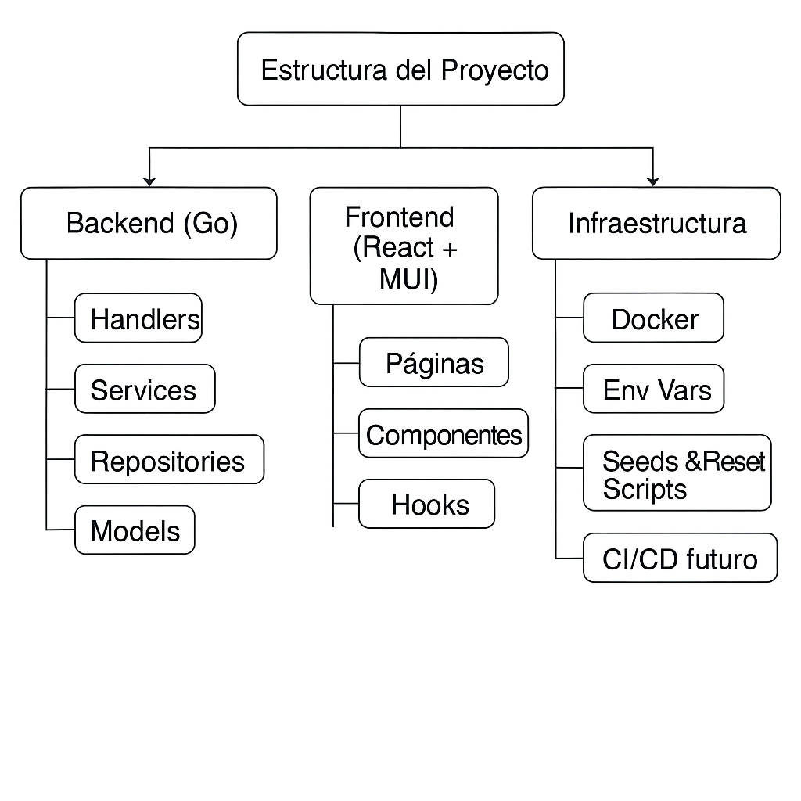

# time-control

Gestión del control horario laboral.

---

## 🧩 Descripción general

Este proyecto implementa un backend en Go para una aplicación de control horario conforme a la normativa laboral española.
Incluye:

- Autenticación con Firebase (JWT)
- Creación automática de usuarios en SQLite
- Roles (user, admin)
- Registro de sesiones de trabajo (inicio, fin, manuales)
- Rutas protegidas para usuarios
- Rutas exclusivas para administradores
- Filtro de sesiones por usuario
- Arquitectura modular y escalable

## 📁 Estructura del proyecto

```text
time-control/
│
├── cmd/
│   └── api/
│       └── main.go
│
├── internal/
│   ├── config/
│   │   └── config.go
│   │
│   ├── database/
│   │   └── sqlite.go
│   │
│   ├── auth/
│   │   └── firebase_middleware.go
│   │
│   ├── users/
│   │   ├── model.go
│   │   ├── repository.go
│   │   ├── service.go
│   │   └── handler.go
│   │
│   ├── sessions/
│   │   ├── model.go
│   │   ├── repository.go
│   │   ├── service.go
│   │   └── handler.go
│   │
│   ├── router/
│   │   └── router.go
│   │
│   └── utils/
│       └── time.go
│
├── data/               ← SQLite DB aquí (no en git)
│   └── .gitignore
│
├── go.mod
└── go.sum
```

---

## 🚀 Tecnologías

- **Go 1.22+**
- **Gorilla Mux**
- **Firebase Admin SDK**
- **SQLite + GORM**
- **Docker (opcional)**

---

## 🔐 Autenticación

El backend utiliza Firebase Authentication.
Cada petición protegida debe incluir:

```text
Authorization: Bearer <token_firebase>
```

El middleware:

1. Valida el token con Firebase
2. Extrae **uid**, **email** y custom claims
3. Crea el usuario en SQLite si no existe
4. Inserta en el contexto:

- **userID**
- **email**
- **role**

---

## 👤 Roles

Cada usuario tiene un campo:

```text
role: "user" | "admin"
```

Por defecto, todos los usuarios nuevos son "user".
Para convertir un usuario en admin:

```sql
UPDATE users SET role = 'admin' WHERE email = 'alex@test.com';
```

---

## 🧭 Rutas de usuario (/me)

Todas requieren autenticación.

▶️ Iniciar sesión

```text
POST /me/sessions/start
```

⏹ Finalizar sesión

```text
POST /me/sessions/end
```

📝 Crear sesión manua

```text
POST /me/sessions/manual
Body:
{
  "date": "2026-01-26",
  "start": "2026-01-26T09:00:00+01:00",
  "end": "2026-01-26T17:00:00+01:00"
}
```

## 📄 Obtener mis sesiones

```text
GET /me/sessions
```

---

## 🛡️ Middleware de roles

El middleware **RequireAdmin** garantiza que solo administradores accedan a rutas **/admin**.

```Go
func RequireAdmin(next http.Handler) http.Handler {
    return http.HandlerFunc(func(w http.ResponseWriter, r *http.Request) {
        role, _ := r.Context().Value(ContextRole).(string)
        if role != "admin" {
            http.Error(w, "forbidden", http.StatusForbidden)
            return
        }
        next.ServeHTTP(w, r)
    })
}
```

---

## 🏛️ Rutas de administrador (/admin)

Todas requieren:

- Token válido
- Rol **admin**

🟢 Ping de verificación

```text
GET /admin/ping
```

Respuesta:

```text
admin ok
```

## 📚 Obtener todas las sesiones

```text
GET /admin/sessions
```

## 🔍 Filtrar sesiones por usuari

```text
GET /admin/sessions?user_id=<UID>
```

Ejemplo:

```text
GET /admin/sessions?user_id=9HWUwJzQNDmPOF4N5L8S2
```

---

## 🗂️ Estructura del router

```text
/me
  /sessions
    POST /start
    POST /end
    POST /manual
    GET  /

/admin
  GET /ping
  GET /sessions
```

---

## 🧱 Estructura de la base de datos

## Tabla **users**

 id (uid Firebase)  email  name  role  created_at

## Tabla **work_sessions**

 id  user_id  start_time  end_time  created_at

---

## 🛠️ Cómo ejecutar el proyecto

1. Instalar dependencias

```text
go mod tidy
```

1. Configurar Firebase

Colocar **firebase-adminsdk.json** en:

```text
/config/firebase/
```

1. Ejecutar el servidor

Servidor en:

```text
http://localhost:8080
```

---

## 🧪 Testing con Postman

Añadir siempre:

```text
Authorization: Bearer <token_firebase>
```

Puedes obtener el token desde tu frontend o desde Firebase Auth.

---

## 🎉 Estado actual del proyecto

- ✔ Autenticación Firebase
- ✔ Creación automática de usuarios
- ✔ Roles (**user**, **admin**)
- ✔ Middleware de admin
- ✔ CRUD de sesiones (solo lectura para admin)
- ✔ Filtro por usuario
- ✔ Base de datos SQLite funcionando
- ✔ Rutas protegidas y organizadas

---

## 📘 Diagrama de arquitectura



## 📌 Próximos pasos (TODO list)

- Filtros por fecha (from, to)
- Paginación para admins
- Exportación de informes
- Dashboard en React/MUI

---
